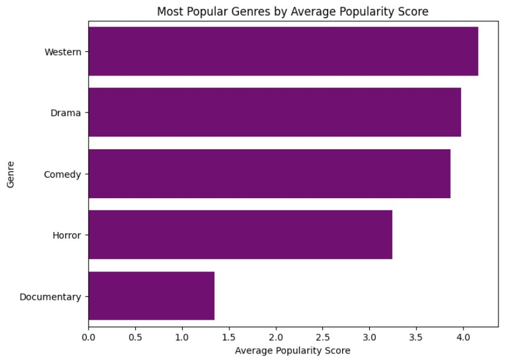
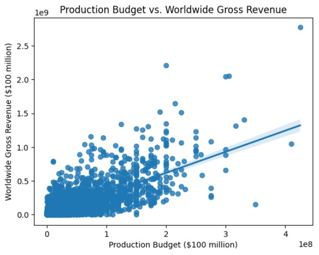
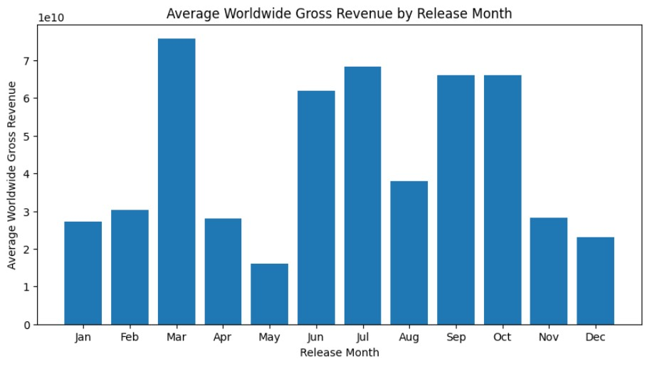

# MICROSOFT'S MOVIE ANALYLIS 


***Author: Wambui Thuku***

# Overview

The goal of this project is to help Microsoft create a new movie studio by exploring the types of films that are currently doing well at the box office. As Microsoft is new to the film industry, they need insights into what types of movies are popular among the audience, and what kind of content will attract them to the theaters. The project involves conducting research and analyzing data on the most successful movies of recent times to identify trends and patterns that can be translated into actionable insights for Microsoft's movie studio. The insights will help the head of the movie studio make informed decisions on what kind of films to create, and increase the chances of success in the competitive industry.

## Business Problem

Microsoft sees all the big companies creating original video content and they want to get in on the fun. They have decided to create a new movie studio, but they don’t know anything about creating movies.I will be exploring what types of films are currently doing the best at the box office. I will then translate those findings into actionable insights that the head of Microsoft's new movie studio can use to help decide what type of films to create. I formulated these three questions to help analyse the data and come up with the required findings.
1. Which movie genres are the most popular?
2. Does production budget affect the returns of the movie?
3. What time of year is best to release movies?

 ## Data Understanding

I will be using data from the following sources;
* Rotten Tomatoes - This file contains information about the Movie titles, Release dates, Genres Ratings or scores (e.g. Rotten Tomatoes score), Reviews or critic quotes, Director and cast information, Runtime & Production company
* The Movie DB - Contains information about the Genre ids, Id, Original language, Original title, Popularity, Release date, Title, Vote average	& Vote count.
* The Numbers - This file contains Id, Release date, Movie titles, Production budget, the domestic box office revenue and the worldwide box office revenue.

## Data Preparation & Cleaning


```python
# importing the packages I will be using for this project
import pandas as pd
import numpy as np
import matplotlib.pyplot as plt
import seaborn as sns

%matplotlib inline
```

In the cells below, I will load the data and inspect the attributes of the dataframes.

 ## Rotten tomatoes


```python
#read the box office mojo csv
rt_df = pd.read_csv("zippedData/rt.movie_info.tsv.gz", delimiter='\t', compression='gzip', encoding='unicode_escape', index_col=0)
rt_df.head(10)
```


<div>
<style scoped>
    .dataframe tbody tr th:only-of-type {
        vertical-align: middle;
    }

    .dataframe tbody tr th {
        vertical-align: top;
    }

    .dataframe thead th {
        text-align: right;
    }
</style>
<table border="1" class="dataframe">
  <thead>
    <tr style="text-align: right;">
      <th></th>
      <th>synopsis</th>
      <th>rating</th>
      <th>genre</th>
      <th>director</th>
      <th>writer</th>
      <th>theater_date</th>
      <th>dvd_date</th>
      <th>currency</th>
      <th>box_office</th>
      <th>runtime</th>
      <th>studio</th>
    </tr>
    <tr>
      <th>id</th>
      <th></th>
      <th></th>
      <th></th>
      <th></th>
      <th></th>
      <th></th>
      <th></th>
      <th></th>
      <th></th>
      <th></th>
      <th></th>
    </tr>
  </thead>
  <tbody>
    <tr>
      <th>1</th>
      <td>This gritty, fast-paced, and innovative police...</td>
      <td>R</td>
      <td>Action and Adventure|Classics|Drama</td>
      <td>William Friedkin</td>
      <td>Ernest Tidyman</td>
      <td>Oct 9, 1971</td>
      <td>Sep 25, 2001</td>
      <td>NaN</td>
      <td>NaN</td>
      <td>104 minutes</td>
      <td>NaN</td>
    </tr>
    <tr>
      <th>3</th>
      <td>New York City, not-too-distant-future: Eric Pa...</td>
      <td>R</td>
      <td>Drama|Science Fiction and Fantasy</td>
      <td>David Cronenberg</td>
      <td>David Cronenberg|Don DeLillo</td>
      <td>Aug 17, 2012</td>
      <td>Jan 1, 2013</td>
      <td>$</td>
      <td>600,000</td>
      <td>108 minutes</td>
      <td>Entertainment One</td>
    </tr>
    <tr>
      <th>5</th>
      <td>Illeana Douglas delivers a superb performance ...</td>
      <td>R</td>
      <td>Drama|Musical and Performing Arts</td>
      <td>Allison Anders</td>
      <td>Allison Anders</td>
      <td>Sep 13, 1996</td>
      <td>Apr 18, 2000</td>
      <td>NaN</td>
      <td>NaN</td>
      <td>116 minutes</td>
      <td>NaN</td>
    </tr>
    <tr>
      <th>6</th>
      <td>Michael Douglas runs afoul of a treacherous su...</td>
      <td>R</td>
      <td>Drama|Mystery and Suspense</td>
      <td>Barry Levinson</td>
      <td>Paul Attanasio|Michael Crichton</td>
      <td>Dec 9, 1994</td>
      <td>Aug 27, 1997</td>
      <td>NaN</td>
      <td>NaN</td>
      <td>128 minutes</td>
      <td>NaN</td>
    </tr>
    <tr>
      <th>7</th>
      <td>NaN</td>
      <td>NR</td>
      <td>Drama|Romance</td>
      <td>Rodney Bennett</td>
      <td>Giles Cooper</td>
      <td>NaN</td>
      <td>NaN</td>
      <td>NaN</td>
      <td>NaN</td>
      <td>200 minutes</td>
      <td>NaN</td>
    </tr>
    <tr>
      <th>8</th>
      <td>The year is 1942. As the Allies unite overseas...</td>
      <td>PG</td>
      <td>Drama|Kids and Family</td>
      <td>Jay Russell</td>
      <td>Gail Gilchriest</td>
      <td>Mar 3, 2000</td>
      <td>Jul 11, 2000</td>
      <td>NaN</td>
      <td>NaN</td>
      <td>95 minutes</td>
      <td>Warner Bros. Pictures</td>
    </tr>
    <tr>
      <th>10</th>
      <td>Some cast and crew from NBC's highly acclaimed...</td>
      <td>PG-13</td>
      <td>Comedy</td>
      <td>Jake Kasdan</td>
      <td>Mike White</td>
      <td>Jan 11, 2002</td>
      <td>Jun 18, 2002</td>
      <td>$</td>
      <td>41,032,915</td>
      <td>82 minutes</td>
      <td>Paramount Pictures</td>
    </tr>
    <tr>
      <th>13</th>
      <td>Stewart Kane, an Irishman living in the Austra...</td>
      <td>R</td>
      <td>Drama</td>
      <td>Ray Lawrence</td>
      <td>Raymond Carver|Beatrix Christian</td>
      <td>Apr 27, 2006</td>
      <td>Oct 2, 2007</td>
      <td>$</td>
      <td>224,114</td>
      <td>123 minutes</td>
      <td>Sony Pictures Classics</td>
    </tr>
    <tr>
      <th>14</th>
      <td>"Love Ranch" is a bittersweet love story that ...</td>
      <td>R</td>
      <td>Drama</td>
      <td>Taylor Hackford</td>
      <td>Mark Jacobson</td>
      <td>Jun 30, 2010</td>
      <td>Nov 9, 2010</td>
      <td>$</td>
      <td>134,904</td>
      <td>117 minutes</td>
      <td>NaN</td>
    </tr>
    <tr>
      <th>15</th>
      <td>When a diamond expedition in the Congo is lost...</td>
      <td>PG-13</td>
      <td>Action and Adventure|Mystery and Suspense|Scie...</td>
      <td>Frank Marshall</td>
      <td>John Patrick Shanley</td>
      <td>Jun 9, 1995</td>
      <td>Jul 27, 1999</td>
      <td>NaN</td>
      <td>NaN</td>
      <td>108 minutes</td>
      <td>NaN</td>
    </tr>
  </tbody>
</table>
</div>


```python
#get the dimension of the data
rt_df.shape
```


    (1560, 11)


```python
rt_df.info()
```

    <class 'pandas.core.frame.DataFrame'>
    Int64Index: 1560 entries, 1 to 2000
    Data columns (total 11 columns):
     #   Column        Non-Null Count  Dtype 
    ---  ------        --------------  ----- 
     0   synopsis      1498 non-null   object
     1   rating        1557 non-null   object
     2   genre         1552 non-null   object
     3   director      1361 non-null   object
     4   writer        1111 non-null   object
     5   theater_date  1201 non-null   object
     6   dvd_date      1201 non-null   object
     7   currency      340 non-null    object
     8   box_office    340 non-null    object
     9   runtime       1530 non-null   object
     10  studio        494 non-null    object
    dtypes: object(11)
    memory usage: 146.2+ KB
    


```python
#drop unwanted columns
rt_df = rt_df.drop(["synopsis", "rating", "director", "writer", "runtime", "studio", "currency", "box_office"], axis=1)
rt_df
```


<div>
<style scoped>
    .dataframe tbody tr th:only-of-type {
        vertical-align: middle;
    }

    .dataframe tbody tr th {
        vertical-align: top;
    }

    .dataframe thead th {
        text-align: right;
    }
</style>
<table border="1" class="dataframe">
  <thead>
    <tr style="text-align: right;">
      <th></th>
      <th>genre</th>
      <th>theater_date</th>
      <th>dvd_date</th>
    </tr>
    <tr>
      <th>id</th>
      <th></th>
      <th></th>
      <th></th>
    </tr>
  </thead>
  <tbody>
    <tr>
      <th>1</th>
      <td>Action and Adventure|Classics|Drama</td>
      <td>Oct 9, 1971</td>
      <td>Sep 25, 2001</td>
    </tr>
    <tr>
      <th>3</th>
      <td>Drama|Science Fiction and Fantasy</td>
      <td>Aug 17, 2012</td>
      <td>Jan 1, 2013</td>
    </tr>
    <tr>
      <th>5</th>
      <td>Drama|Musical and Performing Arts</td>
      <td>Sep 13, 1996</td>
      <td>Apr 18, 2000</td>
    </tr>
    <tr>
      <th>6</th>
      <td>Drama|Mystery and Suspense</td>
      <td>Dec 9, 1994</td>
      <td>Aug 27, 1997</td>
    </tr>
    <tr>
      <th>7</th>
      <td>Drama|Romance</td>
      <td>NaN</td>
      <td>NaN</td>
    </tr>
    <tr>
      <th>...</th>
      <td>...</td>
      <td>...</td>
      <td>...</td>
    </tr>
    <tr>
      <th>1996</th>
      <td>Action and Adventure|Horror|Mystery and Suspense</td>
      <td>Aug 18, 2006</td>
      <td>Jan 2, 2007</td>
    </tr>
    <tr>
      <th>1997</th>
      <td>Comedy|Science Fiction and Fantasy</td>
      <td>Jul 23, 1993</td>
      <td>Apr 17, 2001</td>
    </tr>
    <tr>
      <th>1998</th>
      <td>Classics|Comedy|Drama|Musical and Performing Arts</td>
      <td>Jan 1, 1962</td>
      <td>May 11, 2004</td>
    </tr>
    <tr>
      <th>1999</th>
      <td>Comedy|Drama|Kids and Family|Sports and Fitness</td>
      <td>Apr 1, 1993</td>
      <td>Jan 29, 2002</td>
    </tr>
    <tr>
      <th>2000</th>
      <td>Action and Adventure|Art House and Internation...</td>
      <td>Sep 27, 2001</td>
      <td>Feb 11, 2003</td>
    </tr>
  </tbody>
</table>
<p>1560 rows × 3 columns</p>
</div>


```python
#drop rows with missing values
rt_df = rt_df.dropna(subset=["genre"])
rt_df
```


<div>
<style scoped>
    .dataframe tbody tr th:only-of-type {
        vertical-align: middle;
    }

    .dataframe tbody tr th {
        vertical-align: top;
    }

    .dataframe thead th {
        text-align: right;
    }
</style>
<table border="1" class="dataframe">
  <thead>
    <tr style="text-align: right;">
      <th></th>
      <th>genre</th>
      <th>theater_date</th>
      <th>dvd_date</th>
    </tr>
    <tr>
      <th>id</th>
      <th></th>
      <th></th>
      <th></th>
    </tr>
  </thead>
  <tbody>
    <tr>
      <th>1</th>
      <td>Action and Adventure|Classics|Drama</td>
      <td>Oct 9, 1971</td>
      <td>Sep 25, 2001</td>
    </tr>
    <tr>
      <th>3</th>
      <td>Drama|Science Fiction and Fantasy</td>
      <td>Aug 17, 2012</td>
      <td>Jan 1, 2013</td>
    </tr>
    <tr>
      <th>5</th>
      <td>Drama|Musical and Performing Arts</td>
      <td>Sep 13, 1996</td>
      <td>Apr 18, 2000</td>
    </tr>
    <tr>
      <th>6</th>
      <td>Drama|Mystery and Suspense</td>
      <td>Dec 9, 1994</td>
      <td>Aug 27, 1997</td>
    </tr>
    <tr>
      <th>7</th>
      <td>Drama|Romance</td>
      <td>NaN</td>
      <td>NaN</td>
    </tr>
    <tr>
      <th>...</th>
      <td>...</td>
      <td>...</td>
      <td>...</td>
    </tr>
    <tr>
      <th>1996</th>
      <td>Action and Adventure|Horror|Mystery and Suspense</td>
      <td>Aug 18, 2006</td>
      <td>Jan 2, 2007</td>
    </tr>
    <tr>
      <th>1997</th>
      <td>Comedy|Science Fiction and Fantasy</td>
      <td>Jul 23, 1993</td>
      <td>Apr 17, 2001</td>
    </tr>
    <tr>
      <th>1998</th>
      <td>Classics|Comedy|Drama|Musical and Performing Arts</td>
      <td>Jan 1, 1962</td>
      <td>May 11, 2004</td>
    </tr>
    <tr>
      <th>1999</th>
      <td>Comedy|Drama|Kids and Family|Sports and Fitness</td>
      <td>Apr 1, 1993</td>
      <td>Jan 29, 2002</td>
    </tr>
    <tr>
      <th>2000</th>
      <td>Action and Adventure|Art House and Internation...</td>
      <td>Sep 27, 2001</td>
      <td>Feb 11, 2003</td>
    </tr>
  </tbody>
</table>
<p>1552 rows × 3 columns</p>
</div>


## The Movie DB


```python
#read the csv
tmdb_df = pd.read_csv("zippedData/tmdb.movies.csv.gz", index_col=0)
tmdb_df.head(10)
```


<div>
<style scoped>
    .dataframe tbody tr th:only-of-type {
        vertical-align: middle;
    }

    .dataframe tbody tr th {
        vertical-align: top;
    }

    .dataframe thead th {
        text-align: right;
    }
</style>
<table border="1" class="dataframe">
  <thead>
    <tr style="text-align: right;">
      <th></th>
      <th>genre_ids</th>
      <th>id</th>
      <th>original_language</th>
      <th>original_title</th>
      <th>popularity</th>
      <th>release_date</th>
      <th>title</th>
      <th>vote_average</th>
      <th>vote_count</th>
    </tr>
  </thead>
  <tbody>
    <tr>
      <th>0</th>
      <td>[12, 14, 10751]</td>
      <td>12444</td>
      <td>en</td>
      <td>Harry Potter and the Deathly Hallows: Part 1</td>
      <td>33.533</td>
      <td>2010-11-19</td>
      <td>Harry Potter and the Deathly Hallows: Part 1</td>
      <td>7.7</td>
      <td>10788</td>
    </tr>
    <tr>
      <th>1</th>
      <td>[14, 12, 16, 10751]</td>
      <td>10191</td>
      <td>en</td>
      <td>How to Train Your Dragon</td>
      <td>28.734</td>
      <td>2010-03-26</td>
      <td>How to Train Your Dragon</td>
      <td>7.7</td>
      <td>7610</td>
    </tr>
    <tr>
      <th>2</th>
      <td>[12, 28, 878]</td>
      <td>10138</td>
      <td>en</td>
      <td>Iron Man 2</td>
      <td>28.515</td>
      <td>2010-05-07</td>
      <td>Iron Man 2</td>
      <td>6.8</td>
      <td>12368</td>
    </tr>
    <tr>
      <th>3</th>
      <td>[16, 35, 10751]</td>
      <td>862</td>
      <td>en</td>
      <td>Toy Story</td>
      <td>28.005</td>
      <td>1995-11-22</td>
      <td>Toy Story</td>
      <td>7.9</td>
      <td>10174</td>
    </tr>
    <tr>
      <th>4</th>
      <td>[28, 878, 12]</td>
      <td>27205</td>
      <td>en</td>
      <td>Inception</td>
      <td>27.920</td>
      <td>2010-07-16</td>
      <td>Inception</td>
      <td>8.3</td>
      <td>22186</td>
    </tr>
    <tr>
      <th>5</th>
      <td>[12, 14, 10751]</td>
      <td>32657</td>
      <td>en</td>
      <td>Percy Jackson &amp; the Olympians: The Lightning T...</td>
      <td>26.691</td>
      <td>2010-02-11</td>
      <td>Percy Jackson &amp; the Olympians: The Lightning T...</td>
      <td>6.1</td>
      <td>4229</td>
    </tr>
    <tr>
      <th>6</th>
      <td>[28, 12, 14, 878]</td>
      <td>19995</td>
      <td>en</td>
      <td>Avatar</td>
      <td>26.526</td>
      <td>2009-12-18</td>
      <td>Avatar</td>
      <td>7.4</td>
      <td>18676</td>
    </tr>
    <tr>
      <th>7</th>
      <td>[16, 10751, 35]</td>
      <td>10193</td>
      <td>en</td>
      <td>Toy Story 3</td>
      <td>24.445</td>
      <td>2010-06-17</td>
      <td>Toy Story 3</td>
      <td>7.7</td>
      <td>8340</td>
    </tr>
    <tr>
      <th>8</th>
      <td>[16, 10751, 35]</td>
      <td>20352</td>
      <td>en</td>
      <td>Despicable Me</td>
      <td>23.673</td>
      <td>2010-07-09</td>
      <td>Despicable Me</td>
      <td>7.2</td>
      <td>10057</td>
    </tr>
    <tr>
      <th>9</th>
      <td>[16, 28, 35, 10751, 878]</td>
      <td>38055</td>
      <td>en</td>
      <td>Megamind</td>
      <td>22.855</td>
      <td>2010-11-04</td>
      <td>Megamind</td>
      <td>6.8</td>
      <td>3635</td>
    </tr>
  </tbody>
</table>
</div>


```python
#get the dimension of the data
tmdb_df.shape
```


    (26517, 9)


```python
#get the type of data
tmdb_df.info()
```

    <class 'pandas.core.frame.DataFrame'>
    Int64Index: 26517 entries, 0 to 26516
    Data columns (total 9 columns):
     #   Column             Non-Null Count  Dtype  
    ---  ------             --------------  -----  
     0   genre_ids          26517 non-null  object 
     1   id                 26517 non-null  int64  
     2   original_language  26517 non-null  object 
     3   original_title     26517 non-null  object 
     4   popularity         26517 non-null  float64
     5   release_date       26517 non-null  object 
     6   title              26517 non-null  object 
     7   vote_average       26517 non-null  float64
     8   vote_count         26517 non-null  int64  
    dtypes: float64(2), int64(2), object(5)
    memory usage: 2.0+ MB
    


```python
tmdb_df = tmdb_df.drop(["id", "original_language", "title"], axis=1)
tmdb_df
```


<div>
<style scoped>
    .dataframe tbody tr th:only-of-type {
        vertical-align: middle;
    }

    .dataframe tbody tr th {
        vertical-align: top;
    }

    .dataframe thead th {
        text-align: right;
    }
</style>
<table border="1" class="dataframe">
  <thead>
    <tr style="text-align: right;">
      <th></th>
      <th>genre_ids</th>
      <th>original_title</th>
      <th>popularity</th>
      <th>release_date</th>
      <th>vote_average</th>
      <th>vote_count</th>
    </tr>
  </thead>
  <tbody>
    <tr>
      <th>0</th>
      <td>[12, 14, 10751]</td>
      <td>Harry Potter and the Deathly Hallows: Part 1</td>
      <td>33.533</td>
      <td>2010-11-19</td>
      <td>7.7</td>
      <td>10788</td>
    </tr>
    <tr>
      <th>1</th>
      <td>[14, 12, 16, 10751]</td>
      <td>How to Train Your Dragon</td>
      <td>28.734</td>
      <td>2010-03-26</td>
      <td>7.7</td>
      <td>7610</td>
    </tr>
    <tr>
      <th>2</th>
      <td>[12, 28, 878]</td>
      <td>Iron Man 2</td>
      <td>28.515</td>
      <td>2010-05-07</td>
      <td>6.8</td>
      <td>12368</td>
    </tr>
    <tr>
      <th>3</th>
      <td>[16, 35, 10751]</td>
      <td>Toy Story</td>
      <td>28.005</td>
      <td>1995-11-22</td>
      <td>7.9</td>
      <td>10174</td>
    </tr>
    <tr>
      <th>4</th>
      <td>[28, 878, 12]</td>
      <td>Inception</td>
      <td>27.920</td>
      <td>2010-07-16</td>
      <td>8.3</td>
      <td>22186</td>
    </tr>
    <tr>
      <th>...</th>
      <td>...</td>
      <td>...</td>
      <td>...</td>
      <td>...</td>
      <td>...</td>
      <td>...</td>
    </tr>
    <tr>
      <th>26512</th>
      <td>[27, 18]</td>
      <td>Laboratory Conditions</td>
      <td>0.600</td>
      <td>2018-10-13</td>
      <td>0.0</td>
      <td>1</td>
    </tr>
    <tr>
      <th>26513</th>
      <td>[18, 53]</td>
      <td>_EXHIBIT_84xxx_</td>
      <td>0.600</td>
      <td>2018-05-01</td>
      <td>0.0</td>
      <td>1</td>
    </tr>
    <tr>
      <th>26514</th>
      <td>[14, 28, 12]</td>
      <td>The Last One</td>
      <td>0.600</td>
      <td>2018-10-01</td>
      <td>0.0</td>
      <td>1</td>
    </tr>
    <tr>
      <th>26515</th>
      <td>[10751, 12, 28]</td>
      <td>Trailer Made</td>
      <td>0.600</td>
      <td>2018-06-22</td>
      <td>0.0</td>
      <td>1</td>
    </tr>
    <tr>
      <th>26516</th>
      <td>[53, 27]</td>
      <td>The Church</td>
      <td>0.600</td>
      <td>2018-10-05</td>
      <td>0.0</td>
      <td>1</td>
    </tr>
  </tbody>
</table>
<p>26517 rows × 6 columns</p>
</div>


```python
import ast
```


```python
# change the genre_ids to genres
# define a dictionary that maps genre IDs to genre names
genre_dict = {
    28: 'Action',
    12: 'Adventure',
    16: 'Animation',
    35: 'Comedy',
    80: 'Crime',
    99: 'Documentary',
    18: 'Drama',
    10751: 'Family',
    14: 'Fantasy',
    36: 'History',
    27: 'Horror',
    10402: 'Music',
    9648: 'Mystery',
    10749: 'Romance',
    878: 'Science Fiction',
    10770: 'TV Movie',
    53: 'Thriller',
    10752: 'War',
    37: 'Western'
}

# define a function that replaces genre_ids with genre names
def replace_genre_ids(genre_ids_str):
    genre_ids_list = ast.literal_eval(genre_ids_str)
    genre_names_list = [genre_dict.get(genre_id, 'Unknown') for genre_id in genre_ids_list]
    return genre_names_list

# use the apply() method to apply the replace_genre_ids function to the genre_ids column
tmdb_df['genre'] = tmdb_df['genre_ids'].apply(replace_genre_ids)
tmdb_df = tmdb_df.drop(columns=['genre_ids'])
tmdb_df

```


<div>
<style scoped>
    .dataframe tbody tr th:only-of-type {
        vertical-align: middle;
    }

    .dataframe tbody tr th {
        vertical-align: top;
    }

    .dataframe thead th {
        text-align: right;
    }
</style>
<table border="1" class="dataframe">
  <thead>
    <tr style="text-align: right;">
      <th></th>
      <th>original_title</th>
      <th>popularity</th>
      <th>release_date</th>
      <th>vote_average</th>
      <th>vote_count</th>
      <th>genre</th>
    </tr>
  </thead>
  <tbody>
    <tr>
      <th>0</th>
      <td>Harry Potter and the Deathly Hallows: Part 1</td>
      <td>33.533</td>
      <td>2010-11-19</td>
      <td>7.7</td>
      <td>10788</td>
      <td>[Adventure, Fantasy, Family]</td>
    </tr>
    <tr>
      <th>1</th>
      <td>How to Train Your Dragon</td>
      <td>28.734</td>
      <td>2010-03-26</td>
      <td>7.7</td>
      <td>7610</td>
      <td>[Fantasy, Adventure, Animation, Family]</td>
    </tr>
    <tr>
      <th>2</th>
      <td>Iron Man 2</td>
      <td>28.515</td>
      <td>2010-05-07</td>
      <td>6.8</td>
      <td>12368</td>
      <td>[Adventure, Action, Science Fiction]</td>
    </tr>
    <tr>
      <th>3</th>
      <td>Toy Story</td>
      <td>28.005</td>
      <td>1995-11-22</td>
      <td>7.9</td>
      <td>10174</td>
      <td>[Animation, Comedy, Family]</td>
    </tr>
    <tr>
      <th>4</th>
      <td>Inception</td>
      <td>27.920</td>
      <td>2010-07-16</td>
      <td>8.3</td>
      <td>22186</td>
      <td>[Action, Science Fiction, Adventure]</td>
    </tr>
    <tr>
      <th>...</th>
      <td>...</td>
      <td>...</td>
      <td>...</td>
      <td>...</td>
      <td>...</td>
      <td>...</td>
    </tr>
    <tr>
      <th>26512</th>
      <td>Laboratory Conditions</td>
      <td>0.600</td>
      <td>2018-10-13</td>
      <td>0.0</td>
      <td>1</td>
      <td>[Horror, Drama]</td>
    </tr>
    <tr>
      <th>26513</th>
      <td>_EXHIBIT_84xxx_</td>
      <td>0.600</td>
      <td>2018-05-01</td>
      <td>0.0</td>
      <td>1</td>
      <td>[Drama, Thriller]</td>
    </tr>
    <tr>
      <th>26514</th>
      <td>The Last One</td>
      <td>0.600</td>
      <td>2018-10-01</td>
      <td>0.0</td>
      <td>1</td>
      <td>[Fantasy, Action, Adventure]</td>
    </tr>
    <tr>
      <th>26515</th>
      <td>Trailer Made</td>
      <td>0.600</td>
      <td>2018-06-22</td>
      <td>0.0</td>
      <td>1</td>
      <td>[Family, Adventure, Action]</td>
    </tr>
    <tr>
      <th>26516</th>
      <td>The Church</td>
      <td>0.600</td>
      <td>2018-10-05</td>
      <td>0.0</td>
      <td>1</td>
      <td>[Thriller, Horror]</td>
    </tr>
  </tbody>
</table>
<p>26517 rows × 6 columns</p>
</div>


## The Numbers


```python
#read the csv
tn_df = pd.read_csv("zippedData/tn.movie_budgets.csv.gz", index_col=0)
tn_df.head(10)
```


<div>
<style scoped>
    .dataframe tbody tr th:only-of-type {
        vertical-align: middle;
    }

    .dataframe tbody tr th {
        vertical-align: top;
    }

    .dataframe thead th {
        text-align: right;
    }
</style>
<table border="1" class="dataframe">
  <thead>
    <tr style="text-align: right;">
      <th></th>
      <th>release_date</th>
      <th>movie</th>
      <th>production_budget</th>
      <th>domestic_gross</th>
      <th>worldwide_gross</th>
    </tr>
    <tr>
      <th>id</th>
      <th></th>
      <th></th>
      <th></th>
      <th></th>
      <th></th>
    </tr>
  </thead>
  <tbody>
    <tr>
      <th>1</th>
      <td>Dec 18, 2009</td>
      <td>Avatar</td>
      <td>$425,000,000</td>
      <td>$760,507,625</td>
      <td>$2,776,345,279</td>
    </tr>
    <tr>
      <th>2</th>
      <td>May 20, 2011</td>
      <td>Pirates of the Caribbean: On Stranger Tides</td>
      <td>$410,600,000</td>
      <td>$241,063,875</td>
      <td>$1,045,663,875</td>
    </tr>
    <tr>
      <th>3</th>
      <td>Jun 7, 2019</td>
      <td>Dark Phoenix</td>
      <td>$350,000,000</td>
      <td>$42,762,350</td>
      <td>$149,762,350</td>
    </tr>
    <tr>
      <th>4</th>
      <td>May 1, 2015</td>
      <td>Avengers: Age of Ultron</td>
      <td>$330,600,000</td>
      <td>$459,005,868</td>
      <td>$1,403,013,963</td>
    </tr>
    <tr>
      <th>5</th>
      <td>Dec 15, 2017</td>
      <td>Star Wars Ep. VIII: The Last Jedi</td>
      <td>$317,000,000</td>
      <td>$620,181,382</td>
      <td>$1,316,721,747</td>
    </tr>
    <tr>
      <th>6</th>
      <td>Dec 18, 2015</td>
      <td>Star Wars Ep. VII: The Force Awakens</td>
      <td>$306,000,000</td>
      <td>$936,662,225</td>
      <td>$2,053,311,220</td>
    </tr>
    <tr>
      <th>7</th>
      <td>Apr 27, 2018</td>
      <td>Avengers: Infinity War</td>
      <td>$300,000,000</td>
      <td>$678,815,482</td>
      <td>$2,048,134,200</td>
    </tr>
    <tr>
      <th>8</th>
      <td>May 24, 2007</td>
      <td>Pirates of the Caribbean: At World’s End</td>
      <td>$300,000,000</td>
      <td>$309,420,425</td>
      <td>$963,420,425</td>
    </tr>
    <tr>
      <th>9</th>
      <td>Nov 17, 2017</td>
      <td>Justice League</td>
      <td>$300,000,000</td>
      <td>$229,024,295</td>
      <td>$655,945,209</td>
    </tr>
    <tr>
      <th>10</th>
      <td>Nov 6, 2015</td>
      <td>Spectre</td>
      <td>$300,000,000</td>
      <td>$200,074,175</td>
      <td>$879,620,923</td>
    </tr>
  </tbody>
</table>
</div>


```python
#get the dimension of the data
tn_df.shape
```


    (5782, 5)


```python
#get the type of data
tn_df.info()
```

    <class 'pandas.core.frame.DataFrame'>
    Int64Index: 5782 entries, 1 to 82
    Data columns (total 5 columns):
     #   Column             Non-Null Count  Dtype 
    ---  ------             --------------  ----- 
     0   release_date       5782 non-null   object
     1   movie              5782 non-null   object
     2   production_budget  5782 non-null   object
     3   domestic_gross     5782 non-null   object
     4   worldwide_gross    5782 non-null   object
    dtypes: object(5)
    memory usage: 271.0+ KB
    


```python
# turn the production_budget and wordwide_gross data to integers
tn_df["production_budget"] = tn_df["production_budget"].str.replace(',', '').str.replace('$', '').astype(float)
tn_df["worldwide_gross"] = tn_df["worldwide_gross"].str.replace(',', '').str.replace('$', '').astype(float)
```

    C:\Users\WambuiThuku(KE)\AppData\Local\Temp\ipykernel_4752\4187237374.py:2: FutureWarning: The default value of regex will change from True to False in a future version. In addition, single character regular expressions will *not* be treated as literal strings when regex=True.
      tn_df["production_budget"] = tn_df["production_budget"].str.replace(',', '').str.replace('$', '').astype(float)
    C:\Users\WambuiThuku(KE)\AppData\Local\Temp\ipykernel_4752\4187237374.py:3: FutureWarning: The default value of regex will change from True to False in a future version. In addition, single character regular expressions will *not* be treated as literal strings when regex=True.
      tn_df["worldwide_gross"] = tn_df["worldwide_gross"].str.replace(',', '').str.replace('$', '').astype(float)
    

## Data Analysis

## 1. Which movie genres are the most popular?
To answer this question, we are trying to find out which movie genres have the highest popularity rating. By identifying the most popular genres, movie studios can make data-driven decisions about which types of movies to produce and market to maximize profits.

Joining the dataframes in order to analyse the data.


```python
# use explode to convert the genre lists into individual genres
rt_df_exploded = rt_df.explode("genre")
tmdb_df_exploded = tmdb_df.explode("genre")
# merge the rt_df with the tmdb_df
rtmdb_df = pd.merge(rt_df_exploded, tmdb_df_exploded, on="genre", how="inner")
rtmdb_df
```


<div>
<style scoped>
    .dataframe tbody tr th:only-of-type {
        vertical-align: middle;
    }

    .dataframe tbody tr th {
        vertical-align: top;
    }

    .dataframe thead th {
        text-align: right;
    }
</style>
<table border="1" class="dataframe">
  <thead>
    <tr style="text-align: right;">
      <th></th>
      <th>genre</th>
      <th>theater_date</th>
      <th>dvd_date</th>
      <th>original_title</th>
      <th>popularity</th>
      <th>release_date</th>
      <th>vote_average</th>
      <th>vote_count</th>
    </tr>
  </thead>
  <tbody>
    <tr>
      <th>0</th>
      <td>Comedy</td>
      <td>Jan 11, 2002</td>
      <td>Jun 18, 2002</td>
      <td>Toy Story</td>
      <td>28.005</td>
      <td>1995-11-22</td>
      <td>7.9</td>
      <td>10174</td>
    </tr>
    <tr>
      <th>1</th>
      <td>Comedy</td>
      <td>Jan 11, 2002</td>
      <td>Jun 18, 2002</td>
      <td>Toy Story 3</td>
      <td>24.445</td>
      <td>2010-06-17</td>
      <td>7.7</td>
      <td>8340</td>
    </tr>
    <tr>
      <th>2</th>
      <td>Comedy</td>
      <td>Jan 11, 2002</td>
      <td>Jun 18, 2002</td>
      <td>Despicable Me</td>
      <td>23.673</td>
      <td>2010-07-09</td>
      <td>7.2</td>
      <td>10057</td>
    </tr>
    <tr>
      <th>3</th>
      <td>Comedy</td>
      <td>Jan 11, 2002</td>
      <td>Jun 18, 2002</td>
      <td>Megamind</td>
      <td>22.855</td>
      <td>2010-11-04</td>
      <td>6.8</td>
      <td>3635</td>
    </tr>
    <tr>
      <th>4</th>
      <td>Comedy</td>
      <td>Jan 11, 2002</td>
      <td>Jun 18, 2002</td>
      <td>Toy Story 2</td>
      <td>22.698</td>
      <td>1999-11-24</td>
      <td>7.5</td>
      <td>7553</td>
    </tr>
    <tr>
      <th>...</th>
      <td>...</td>
      <td>...</td>
      <td>...</td>
      <td>...</td>
      <td>...</td>
      <td>...</td>
      <td>...</td>
      <td>...</td>
    </tr>
    <tr>
      <th>2035351</th>
      <td>Western</td>
      <td>NaN</td>
      <td>NaN</td>
      <td>A Fistful of Lead</td>
      <td>1.917</td>
      <td>2018-12-04</td>
      <td>7.5</td>
      <td>2</td>
    </tr>
    <tr>
      <th>2035352</th>
      <td>Western</td>
      <td>NaN</td>
      <td>NaN</td>
      <td>A Reckoning</td>
      <td>1.842</td>
      <td>2018-08-07</td>
      <td>5.0</td>
      <td>1</td>
    </tr>
    <tr>
      <th>2035353</th>
      <td>Western</td>
      <td>NaN</td>
      <td>NaN</td>
      <td>The Divide</td>
      <td>1.552</td>
      <td>2018-01-01</td>
      <td>2.0</td>
      <td>1</td>
    </tr>
    <tr>
      <th>2035354</th>
      <td>Western</td>
      <td>NaN</td>
      <td>NaN</td>
      <td>Tryouts</td>
      <td>1.546</td>
      <td>2018-02-09</td>
      <td>7.0</td>
      <td>1</td>
    </tr>
    <tr>
      <th>2035355</th>
      <td>Western</td>
      <td>NaN</td>
      <td>NaN</td>
      <td>Poor Boy</td>
      <td>0.806</td>
      <td>2018-07-13</td>
      <td>5.0</td>
      <td>3</td>
    </tr>
  </tbody>
</table>
<p>2035356 rows × 8 columns</p>
</div>


```python
# group the dataframe by genre and calculate the mean of the popularity column
genre_scores = rtmdb_df.groupby("genre")["popularity"].mean()

# sort the series by the mean popularity score in descending order to get the most popular genres
genre_scores = genre_scores.sort_values(ascending=False)

# create a horizontal bar chart of the mean popularity scores for each genre
fig, ax = plt.subplots(figsize=(8, 6))
sns.barplot(x=genre_scores, y=genre_scores.index, ax=ax, color="purple")

# set the plot title and axis labels
ax.set_title("Most Popular Genres by Average Popularity Score")
ax.set_xlabel("Average Popularity Score")
ax.set_ylabel("Genre")

# display the plot
plt.show()

```


    

    


In the above bar chart, we see that the Western genre is the most popular followed by drama and comedy.

## Does production budget affect the returns of the movie?
To answer this question,I wil be performing an analysis of the relationship between production budget and box office revenue.


```python
# Create the reg plot
sns.regplot(x="production_budget", y="worldwide_gross", data=tn_df)
plt.title("Production Budget vs. Worldwide Gross Revenue")
plt.xlabel("Production Budget ($100 million)")
plt.ylabel("Worldwide Gross Revenue ($100 million)")
plt.show()
```


    

    


There seems to be a positive linear relationship between the production budget and worldwide gross revenue, which means that as the production budget increases, so does the worldwide gross revenue. The regression line shows the best fit line through the data points, and it has a positive slope, indicating the positive relationship between the variables. The regression line can also be used to make predictions about the worldwide gross revenue for a given production budget.

## What time of year is best to release movies?
To answer this question I am trying to find out when is the optimal time to release a movie in order to maximize its box office revenue.


```python
#group the data by month
monthly_gross = tn_df.groupby(pd.to_datetime(tn_df['release_date']).dt.strftime('%B'))['worldwide_gross'].sum()
monthly_gross = monthly_gross.fillna(0)
# Set the figure size
plt.figure(figsize=(10, 5))

# Create the bar chart
plt.bar(monthly_gross.index, monthly_gross.values)

# Set the axis labels and title
plt.xlabel("Release Month")
plt.ylabel("Average Worldwide Gross Revenue")
plt.title("Average Worldwide Gross Revenue by Release Month")
plt.xticks(np.arange(12), ['Jan', 'Feb', 'Mar', 'Apr', 'May', 'Jun', 'Jul', 'Aug', 'Sep', 'Oct', 'Nov', 'Dec'])

# Show the plot
plt.show()
```


    

    


The barchart shows that the months of March, June, July, September and October have consistently higher average gross revenue compared to others, March being the highest. This suggests that these months are the best time of year to release movies.
On the other hand, the months of January, May, and December have consistently lower average gross revenue compared to the other months, with May being the lowest. This suggests that these months may not be the best time to release movies.

## Conclusions 
This analysis leads to three recommendations for Microsoft:
* **Focus on producing Western and Drama movie genres.** Since the Western genre has the highest ratings, it would be wise to start production of movies in that genre. Microsoft can also include the Drama genre as it is second in popularity.
* **Invest heavily in production.** The analysis shows that revenue increases with increase in production budget. 
* **Schedule movie release dates around the months of March, June, July, September and October.** This is because these months have recorded a higher revenue than others.

## Next Steps

Further analyses could yield additional insights to further help Microsft succeed in the movie industry.

* The information from popularity analysis can also be used to identify trends in audience preferences and anticipate changes in the movie industry.
* Explore other factors besides production budget that may also influence the worldwide gross revenue of a movie.
* Consider other factors when deciding on a release date, such as competition from other movies and holidays.
